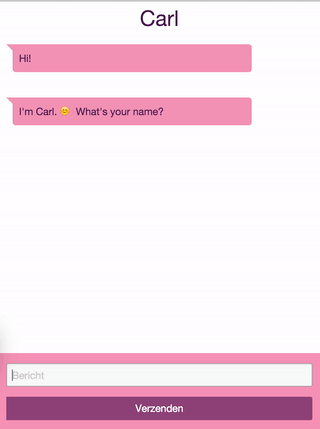

# Chatengine

Chatengine is a web application to quickly prototype and test chats with. You can create many types of conversations by editing a [JSON](http://json.org/)-like file with the conversation definition and host the resulting prototype as a standard mobile website.

## Run

Host the files locally with the command: ``python -m SimpleHTTPServer`` and go to [http://localhost:8000/](http://localhost:8000/) for a sample conversation.

## Example

## Documentation

We use a fake JSON file as our conversation. You can find and edit this file in: ``js/conversation.js``

The file contains a conversation object with nodes indexed by a string (in our case numbers). A node can contain a bunch of stuff:

* "statement" (required) what our bot says. This can be a string, a array of strings or a function (with context) that returns an array of strings.
* "options" an array of options the user can choose. Each option is rendered as a button that the user can select (which they then also say as a response) and a "consequence" which is the next node we move to after.
* "input" will replace options and give the user an input field. What the user types is stored in the context under "name" and we then move to consequence.
* "sideeffect" a Javascript function that is executed at the start of a node. We use this mostly to set variables in the context but it could do anything.

## Tools

Built with [Zurb Foundation](http://foundation.zurb.com).

For local development we recommend using [CodeKit](http://incident57.com/codekit/).
